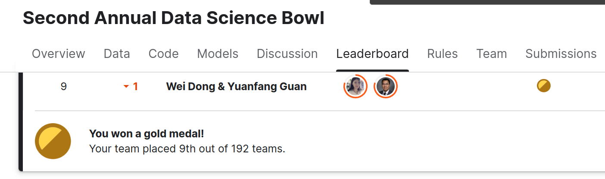

# Annual Data Science Bow Model Submission

Wei Dong	wdong@wdong.org
Yuanfang Guan	yuanfang.guan@gmail.com

https://www.kaggle.com/c/second-annual-data-science-bowl/leaderboard



## Quick Start

Download the binary release from
http://a2genomics.com/static/aaalgo-adbs2.tar.bz2
Our binary release can be run from any X86_64 linux
machine.  It depends on the ImageMagick package
to produce the gif animation (if you have the "convert"
command then it's already satisfied).  No other software
or hardware dependency.

```
./study test/10/study  output --gif
```

Then use a browser to open output/index.html to see the
visualization. 

Our binary release is a compressed version of our
final submission and it binary-reproduces the rank 9
score of 0.011645.

## How to run model on test set.

Our model (scientific approach) consists of a set of binary programs (study,
touchup) and a set of offline pre-trained model files (models/, pre/).  These
pre-trained models are frozen at model submission and are not
to be retrained for the final test set.  The bash scripts included in the
submission specify the running order and parameters of study and touchup.
They might need to be slightly altered to accomodate test data layout.

### System Dependency

Hardware: any x86_64 machine with > 4GB memory.
Software: 64-bit Linux with a modern kernel (Centos > 2.6, Ubuntu > 12.04)

The package doesn't depend on other software to produce the submission
files.  The study program needs ImageMagick to produce GIF visualization, but
this is not needed for producing the submission files.
for producing the submission files.

### Data Preparation

Training and validation studies are numbered from 1-700.
It is assumed that testing data are also similarly numbered, not using
numbers between 1-700 which are already used.

Prepare a file named TEST and list the test study numbers, like the
provided TRAIN FILE.

Prepare a directory (or a symbolic link to a directory) named "raw",
containing all the training, validating and testing data, like the
following structure:

raw/1/study/2ch_21/...
raw/1/study/sax_10/...
...
raw/700/study/2ch_15/..
raw/700/study/sax_10/..
....

There is a train.csv file in the directory, which contains the
groundtruth data.  When validation set is released, the groundtruth
data should be merged into this file.

### Running the Programs

```
./run-study.sh
./run-submit1.sh
./run-submit2.sh
```

The first script does common computation of the two submissions;
the following two scripts generate two versions of final submissions.
Each of the run-submit scripts generates a series of submit files
with priorities specified as below:

{pre/}ws_full1/submit
{pre/}ws_full0/submit
{pre/}ws_one/submit
{pre/}ws_cli/submit

(run-submit1.sh output do not have "pre", run-submit2.sh output has "pre".)

The top submit file in the specified rank that is successfully
produced should be used as final submission.  In the rare/unexpected event when
a high ranked submit file has NaN/Inf entries due to unforeseen failure modes,
 lines containing such bad entries in the submit file should be manually replaced
with the corresponding lines in the next highest ranked submit file that doesn't
have any NaN/Inf in the corresponding lines.
This manual check and possible replacement is considered one
step in our scientific approach.

## Training pre-computed models.

### Training caffe models.

Our caffe models included in the submission are trained with
annotated training set only.  These models are considered frozen
with the submission and is not to be retrained after the release
of test set.

Following recipe is just for reference.

Build the code, run.
```
caffe/bound/import.sh
caffe/bound/train.sh
caffe/contour/import.sh
caffe/contour/train.sh
```
We pick the bound parameter of the 562000th iteration
and contour parameter of the 450000th iteration.

We haven't tested the binary reproducibility of this process.
Our submitted models should be used to produce the final submissions
as they are.
